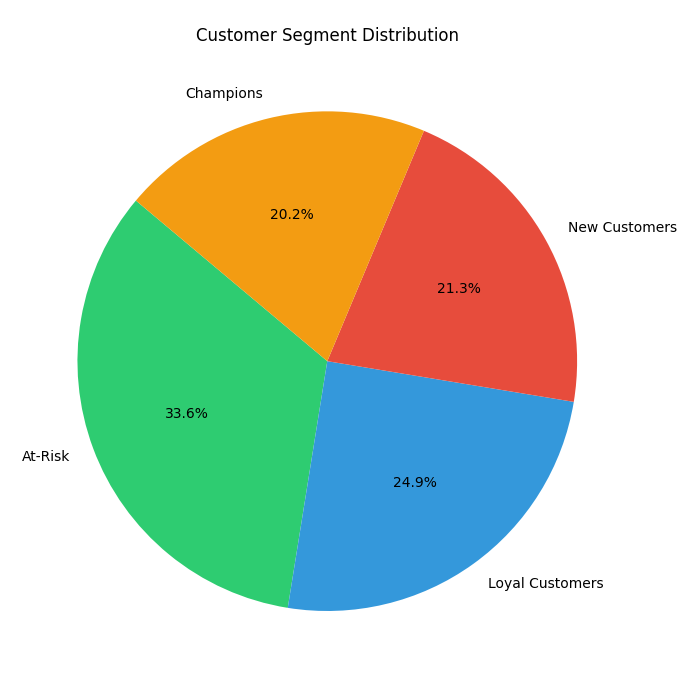
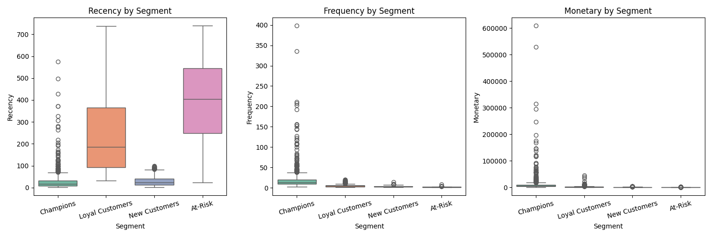
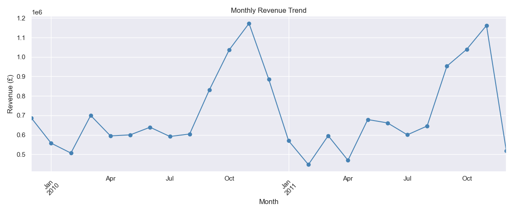

# 🛒 E-Commerce Sales & Customer Segmentation Analysis

A end-to-end data analytics project analyzing 1M+ retail transactions to uncover sales trends and segment customers using RFM analysis and K-Means clustering.

---

## 📊 Live Dashboard
🔗 [Coming soon — Streamlit deployment]

---

## 🎯 Project Objectives
- Identify top-selling products and seasonal revenue trends
- Segment customers into meaningful groups using RFM + K-Means
- Build an interactive dashboard for business decision-making

---

## 📁 Dataset
- **Source:** UCI Online Retail II Dataset
- **Size:** 1,067,371 transactions → 805,549 after cleaning
- **Period:** December 2009 – December 2011
- **Features:** Invoice, StockCode, Description, Quantity, InvoiceDate, Price, CustomerID, Country

---

## 🛠️ Tech Stack
| Tool | Purpose |
|------|---------|
| Python | Core language |
| pandas | Data cleaning & manipulation |
| matplotlib / seaborn | Static visualizations |
| scikit-learn | K-Means clustering |
| plotly | Interactive charts |
| Streamlit | Web dashboard |

---

## 📂 Project Structure
ecommerce-segmentation/
├── data/
│   ├── clean_data.csv        ← cleaned dataset
│   └── rfm_segments.csv      ← RFM + cluster labels
├── reports/
│   ├── top_products.png
│   ├── monthly_trend.png
│   ├── segment_pie.png
│   ├── rfm_boxplots.png
│   └── segment_scatter.png
├── 1_load_clean.py           ← data loading & cleaning
├── 2_eda.py                  ← exploratory data analysis
├── 3_rfm_clustering.py       ← RFM + K-Means clustering
├── app.py                    ← Streamlit dashboard
└── README.md
---

## 🔍 Key Findings

### Sales Insights
- Total revenue: **£17,743,429** across 5,878 customers
- **United Kingdom** dominates with 90%+ of revenue
- Clear **Christmas seasonal spike** visible every November–December
- Top product: **Dotcom Postage** by total revenue

### Customer Segments (K-Means, K=4)
| Segment | Customers | Avg Recency | Avg Frequency | Avg Monetary |
|---------|-----------|-------------|---------------|--------------|
| Champions | 1,188 | 27 days | 19 orders | £11,014 |
| Loyal Customers | 1,465 | 228 days | 5 orders | £2,002 |
| New Customers | 1,251 | 28 days | 3 orders | £865 |
| At-Risk | 1,974 | 396 days | 1 order | £326 |

### High-Value Customer Profile (Champions)
- Purchased within the last **27 days**
- Place **19+ orders** on average
- Spend **£11,000+** in total
- Strategy: Reward with loyalty programs, early access to new products

---

## 🚀 How to Run Locally

```bash
# 1. Clone the repo
git clone https://github.com/himanshunath007/ecommerce-segmentation.git
cd ecommerce-segmentation

# 2. Install dependencies
pip install pandas numpy matplotlib seaborn scikit-learn plotly streamlit openpyxl

# 3. Download dataset from Kaggle and place in data/
# https://www.kaggle.com/datasets/mashlyn/online-retail-ii-uci

# 4. Run scripts in order
python 1_load_clean.py
python 2_eda.py
python 3_rfm_clustering.py

# 5. Launch dashboard
streamlit run app.py
```

---

## 📈 Dashboard Preview

### Key Metrics


### Customer Segments


### Sales Trend


---

## 💼 Business Recommendations
- **Champions (1,188):** VIP loyalty program, early product access
- **Loyal Customers (1,465):** Upsell higher-value products, membership perks
- **New Customers (1,251):** Onboarding offers, first repeat purchase discounts
- **At-Risk (1,974):** Win-back email campaigns, special discounts

---

## 👨‍💻 Author
Khushi Tripathi 
github :-  https://github.com/khushicoder2003
Email : - khushitrip6388@gmail.com